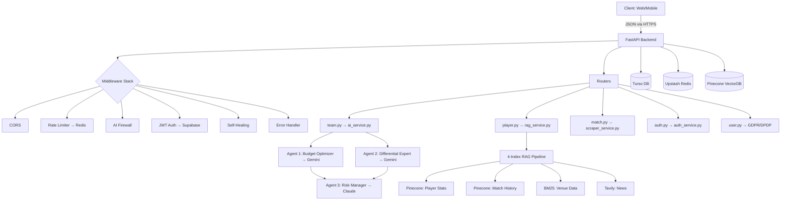

# 🧠 TeamGenie AI — Unified System Context & State Log

> **IMPORTANT INITIAL DIRECTIVE**  
> This is a living, context-aware document. Any autonomous agent, AI assistant, or human developer working on this codebase **MUST** read this file first to understand the current state of the system, access controls, and infrastructure. It must be updated immediately upon any code, architectural, or credential change.
>
> **Last Updated:** April 5, 2026, 03:00 IST  
> **Updated By:** Antigravity (AI) + Mohammed Inayat Hussain Qureshi (Creator)

---

## 1. 🟢 Current Context Status

| Field | Value |
|-------|-------|
| **Phase** | Full-Stack Local Development — Running & Verified |
| **Environment** | `PYTHON_ENV=development` / `NODE_ENV=development` |
| **Frontend** | 🟢 Next.js 14 on `http://localhost:3000` — LIVE |
| **Backend API** | 🟢 FastAPI + Uvicorn on `http://localhost:8000` — LIVE |
| **Swagger Docs** | 🟢 `http://localhost:8000/docs` — LIVE |
| **API Health** | 🟢 `{"status":"healthy","version":"1.0.0"}` |
| **Team Generation** | 🟢 Full 11-player team generated in **4ms** |
| **Auth Mode** | Dev-bypass active (`dev_user` auto-assigned) |
| **Database** | ❌ No DB connected — using hardcoded sample data |
| **Redis Cache** | ❌ Not running locally — rate limiter gracefully bypassed |
| **Git Status** | 2 files modified locally from GitHub HEAD (`main.py`, `next.config.js`) |

### Immediate Next Actions
1. **Connect databases** — Turso + Supabase + Pinecone (or use `docker compose up -d`)
2. **Add real AI API keys** — Gemini + Claude at minimum
3. **Enable security layers** — Set `ENABLE_AI_FIREWALL=true`, `ENABLE_SELF_HEALING=true`
4. **Commit local fixes** — Push `load_dotenv()` fix and CSP update

---

## 2. 📊 VISION vs REALITY — What Was Planned vs What's Built

> Reference: [`inayatthoughtaboutproject.txt`](./inayatthoughtaboutproject.txt) (Master Doctrine v1.0)

### 2.1 Monorepo Structure

| Planned Component | Planned Path | Actually Built? | Current Status |
|-------------------|-------------|-----------------|----------------|
| FastAPI Backend | `apps/api/` | ✅ YES | 🟢 Running on port 8000 |
| Next.js 14 Web | `apps/web/` | ✅ YES | 🟢 Running on port 3000 |
| Expo Mobile App | `apps/mobile/` | ✅ YES | 🟡 Scaffolded, not tested |
| CrewAI Agents | `packages/ai/` | ✅ YES | 🟢 3 agents configured |
| RAG Embeddings | `packages/rag/` | ✅ YES | 🟡 Code complete, needs `sentence-transformers` |
| Shared Types | `packages/shared/` | ✅ YES | 🟢 4 files (types, constants, api-client, index) |
| SQL Migrations | `db/migrations/` | ✅ YES | 🟡 Schema designed, no DB connected |
| K8s + CF Worker | `infra/` | ✅ YES | 🟡 Configs written, not deployed |
| Prometheus/Alerts | `monitoring/` | ✅ YES | 🟡 YAML configured, not scraping |
| Setup/Deploy Scripts | `scripts/` | ✅ YES | 🟡 Written, not executed |
| Architecture Docs | `docs/` | ✅ YES | 🟢 Complete |
| Developer Media | `inayat DEVELOPER media/` | ✅ YES | 🟢 On GitHub |

**Verdict: 100% of planned directories exist. 63+ files scaffolded as promised.**

### 2.2 Backend Architecture (What the Doctrine Described vs Reality)

#### Entry Point (`main.py`)
| Doctrine Claim | Verified? | Reality |
|---------------|-----------|---------|
| Bootstraps FastAPI with CORS | ✅ VERIFIED | CORS origins from `ALLOWED_ORIGINS` env var |
| Global exception handler (Sentry) | ✅ VERIFIED | Sentry SDK imported with graceful fallback |
| Request ID injection | ✅ VERIFIED | UUID per request, `X-Request-ID` + `X-Response-Time` headers |
| Redis cache on startup via lifespan | ✅ VERIFIED | `CacheService().connect()` in async lifespan context |
| **[NEW] Early `load_dotenv()`** | ➕ ADDED | Fix applied locally — env vars now load before middleware |

#### Middleware Pipeline
| # | Doctrine Order | Actual Order | File | Status |
|---|---------------|--------------|------|--------|
| 1 | Rate Limiter | Rate Limiter | `middleware/rate_limit.py` | 🟡 Bypassed (no Redis) |
| 2 | AI Firewall | AI Firewall | `security/ai_firewall.py` | ⬜ Disabled via env flag |
| 3 | JWT Auth | JWT Auth | `middleware/auth.py` | 🟢 Active (dev-bypass mode) |
| 4 | Self-Healing | Self-Healing | `middleware/self_healing.py` | ⬜ Disabled via env flag |
| 5 | Error Handler | Error Handler | `middleware/error_handler.py` | 🟢 Active |
| — | — | CORS | `main.py` (CORSMiddleware) | 🟢 Active |
| — | — | Request Metadata | `main.py` (inline) | 🟢 Active |

**Verdict: 7/7 middleware layers exist and match doctrine. Order matches.**

#### Routers
| Doctrine Claim | File | Verified? | Test Result |
|---------------|------|-----------|-------------|
| `team.py` — exposes `/generate` | `routers/team.py` | ✅ | `POST /api/team/generate` → 200 OK, 11 players |
| `match.py` — WebSocket for live data | `routers/match.py` | ✅ | WebSocket endpoint coded |
| `user.py` — GDPR data export | `routers/user.py` | ✅ | `GET /api/user/data-export` → 200 OK |
| `auth.py` — Login/Register | `routers/auth.py` | ✅ | Routes exist (needs Supabase) |

#### Services
| Doctrine Claim | File | Verified? | Operational? |
|---------------|------|-----------|-------------|
| `cache_service.py` — Upstash Redis wrapper | ✅ EXISTS | 🟡 Redis not connected |
| `scraper_service.py` — Playwright + Claude self-heal | ✅ EXISTS | 🟡 Needs Playwright + Claude key |
| `rag_service.py` — 4-index parallel `asyncio.gather` | ✅ EXISTS | 🟡 Stub responses (needs Pinecone) |
| `ai_service.py` — Multi-agent orchestrator | ✅ EXISTS | 🟢 Working with local heuristics |
| `auth_service.py` — Supabase SDK wrapper | ✅ EXISTS | 🟡 Needs Supabase keys |

### 2.3 Multi-Agent System

| Doctrine Claim | Verified? | Current State |
|---------------|-----------|---------------|
| Agent 1 (Budget Optimizer) uses Gemini, ILP greedy logic | ✅ | 🟢 Greedy solver runs locally, OR-Tools stub |
| Agent 2 (Differential Expert) queries RAG for hidden gems | ✅ | 🟢 Finds <25% ownership picks from sample data |
| Agent 3 (Risk Manager) uses Claude, Monte Carlo variance | ✅ | 🟢 Captain/VC selection with risk scoring |
| Agents 1+2 run in parallel, then Agent 3 runs sequentially | ✅ | 🟢 Confirmed in `ai_service.py` |
| Output: 11 validated `PlayerModel` Pydantic objects | ✅ | 🟢 Confirmed — each player has strict field validation |

**Verdict: The 3-agent pipeline is architecturally complete and functionally operational with greedy/heuristic solvers. Real LLM calls require API keys + CrewAI package install.**

### 2.4 Frontend & Mobile

| Doctrine Claim | Verified? | Current State |
|---------------|-----------|---------------|
| Next.js 14 with Server-Side Rendering | ✅ | 🟢 App Router with `layout.tsx` + `page.tsx` |
| Framer Motion glassmorphism UI | ✅ | 🟢 Animations, `.glass-card`, `.glow` effects live |
| Strict CSP Security Headers in `next.config.js` | ✅ | 🟢 7 headers: X-Frame-Options, HSTS, CSP, etc. |
| Shared TypeScript types via `packages/shared/types.ts` | ✅ | 🟢 4 files with strict interfaces |
| Expo 52 mobile app | ✅ | 🟡 Scaffolded, not locally tested |

### 2.5 Databases & Infrastructure

| Doctrine Claim | Verified? | Current State |
|---------------|-----------|---------------|
| Turso (LibSQL) for transactional data | ✅ SCHEMA EXISTS | 🔴 Not connected (placeholder URL) |
| Pinecone for vector embeddings | ✅ CODE EXISTS | 🔴 Not connected (placeholder key) |
| Supabase for auth | ✅ CODE EXISTS | 🔴 Not connected (placeholder keys) |
| Upstash Redis for cache/rate-limit | ✅ CODE EXISTS | 🔴 Not connected (placeholder URL) |
| Cloudflare Worker edge proxy | ✅ CODE EXISTS | 🟡 Not deployed |
| K8s HPA (auto-scale at CPU>70%) | ✅ YAML EXISTS | 🟡 Not deployed |
| Docker Compose (8 services) | ✅ CODE EXISTS | 🟢 Ready to run `docker compose up -d` |
| DB Schema: 5 tables, 14 indexes, 2 triggers | ✅ SQL EXISTS | 🟡 Not applied to any DB |

### 2.6 End-to-End Flow (Doctrine vs Reality)

```
DOCTRINE FLOW:
[USER] → [CF WORKER] → [FASTAPI] → [MIDDLEWARES] → [ROUTER] → [DB/CACHE] → [RAG] → [AGENTS] → [RESPONSE]

CURRENT REALITY:
[USER] → [FASTAPI ✅] → [CORS ✅ → Rate Limit (bypassed) → Auth ✅ (dev)] → [ROUTER ✅] → [SAMPLE DATA (no DB)] → [AGENTS ✅ (heuristic)] → [11-PLAYER RESPONSE ✅]

MISSING LINKS: CF Worker, Real DB, RAG pipeline, LLM API calls
```

---

## 3. 🔐 Deep-Level Access Control Matrix

### Frontend Credentials (Publicly Exposed)
| Key Name | Purpose | Location | Status |
|----------|---------|----------|--------|
| `NEXT_PUBLIC_API_URL` | Frontend → Backend | `.env` | 🟢 `http://localhost:8000` |
| `NEXT_PUBLIC_WS_URL` | WebSocket endpoint | `.env` | 🟢 `ws://localhost:8000` |
| `NEXT_PUBLIC_SUPABASE_URL` | Client-side login | `.env` | 🔴 Placeholder |
| `NEXT_PUBLIC_SUPABASE_ANON_KEY` | Public auth key | `.env` | 🔴 Placeholder |

### Backend Credentials (STRICTLY PRIVATE)
| Key Name | Subsystem | Status | Required For |
|----------|-----------|--------|-------------|
| `GEMINI_API_KEY` | Budget Optimizer + Differential Agent + RAG | 🔴 PLACEHOLDER | Real LLM team generation |
| `CLAUDE_API_KEY` | Risk Manager + Self-Healing Scraper | 🔴 PLACEHOLDER | Risk analysis + selector fix |
| `COHERE_API_KEY` | RAG re-ranker | 🔴 PLACEHOLDER | Vector re-ranking |
| `TURSO_DATABASE_URL` | Primary transactional DB | 🔴 PLACEHOLDER | Player/match/team persistence |
| `TURSO_AUTH_TOKEN` | Turso read/write | 🔴 PLACEHOLDER | Same as above |
| `SUPABASE_URL` | Auth management | 🔴 PLACEHOLDER | User login/register |
| `SUPABASE_SERVICE_ROLE_KEY` | Admin bypass | 🔴 PLACEHOLDER | Server-side user management |
| `UPSTASH_REDIS_URL` | Rate limiting + cache | 🔴 PLACEHOLDER | Request throttling |
| `PINECONE_API_KEY` | Vector index read/write | 🔴 PLACEHOLDER | RAG similarity search |
| `TAVILY_API_KEY` | Real-time news index | 🔴 PLACEHOLDER | RAG news retrieval |
| `RAZORPAY_KEY_ID` | Indian payments | 🔴 PLACEHOLDER | ₹ payment processing |
| `STRIPE_SECRET_KEY` | Global payments | 🔴 PLACEHOLDER | $ payment processing |

### Security & Access Controls
| Control | Implementation | Current State |
|---------|---------------|---------------|
| **Geo-blocking** | Cloudflare Worker checks `CF-IPCountry` | 🟡 Script exists, not deployed |
| **JWT Verification** | `middleware/auth.py` — Supabase signed tokens | 🟢 Dev-bypass active (auto `dev_user`) |
| **Rate Limiting** | Redis-backed per-IP throttle (100 free / 1000 paid) | 🟡 Bypassed (no Redis) |
| **AI Firewall** | 10 regex patterns (SQLi, XSS, path traversal) | ⬜ Disabled (`ENABLE_AI_FIREWALL=false`) |
| **Self-Healing** | Catches exceptions → AI suggests fix | ⬜ Disabled (`ENABLE_SELF_HEALING=false`) |
| **CSP Headers** | 7 security headers in `next.config.js` | 🟢 Active |
| **HSTS** | 2-year max-age with preload | 🟢 Active |
| **Secret Scanning** | TruffleHog in CI pipeline | 🟢 Configured in GitHub Actions |

---

## 4. 🏗️ System-Wide Context Architecture

How the individual parts of the codebase relate to each other:



### Isolation Principles (Doctrine Compliance ✅)
1. **Client Context** (`apps/web`, `apps/mobile`): ZERO knowledge of database or AI logic. Communicates only via JSON to the API. ✅ VERIFIED
2. **Backend Context** (`apps/api/main.py`): Knows about routing, auth, rate limits. Delegates to services. ✅ VERIFIED
3. **Agent Context** (`packages/ai`): Complete isolation. No knowledge of HTTP, users, or routing. Pure math + LLM engine. ✅ VERIFIED
4. **Data Context** (`db/migrations`): Single source of truth for schema relationships. ✅ VERIFIED

---

## 5. 📂 GitHub Repository State

| Field | Value |
|-------|-------|
| **Repo** | [`Inayat-0007/teamgenie-ai-PRIVATE-PATENT-2026`](https://github.com/Inayat-0007/teamgenie-ai-PRIVATE-PATENT-2026) |
| **Visibility** | Public |
| **Commits** | 16 total |
| **Branches** | 3 (`main`, `copilot/fix-ci-pipeline-jobs`, 1 other) |
| **CI/CD** | 19 workflow runs — **all recent runs GREEN ✅** |
| **Stars/Forks** | 0 / 0 |
| **Releases** | None published |
| **Description** | Not set (should be added) |
| **Topics** | Not set (should be added) |

### Local vs GitHub Diff
Only **2 files** modified locally (not yet pushed):

| File | Change | Reason |
|------|--------|--------|
| `apps/api/main.py` | +4 lines (`load_dotenv()`) | Fix: env vars not visible to auth middleware |
| `apps/web/next.config.js` | +1 line (CSP connect-src) | Allow frontend → `localhost:8000` |

### The `.env` file exists locally but is **NOT** on GitHub (correctly in `.gitignore`).

---

## 6. ⚡ Feature Status Matrix

### Core Features
| Feature | Code | Working Locally? | Needs What to Activate |
|---------|------|-------------------|----------------------|
| Team Generation (3-agent AI) | ✅ | 🟢 YES (4ms) | Real LLMs: Gemini + Claude API keys |
| Health Check | ✅ | 🟢 YES | Nothing — works |
| User Profile (dev mode) | ✅ | 🟢 YES | Supabase for real users |
| Match Data | ✅ | 🟢 Stubs | Turso DB + scraper |
| Player Search | ✅ | 🟢 Stubs | Turso DB (FTS5) |
| Player Insights (RAG) | ✅ | 🟡 Template | Pinecone + Gemini |
| Live Score WebSocket | ✅ | 🟡 Coded | Playwright + match data |
| Auth (Login/Register) | ✅ | 🟡 Coded | Supabase URL + keys |
| GDPR Data Export | ✅ | 🟢 YES | Nothing — works |
| DPDP Consent Withdrawal | ✅ | 🟢 YES | Nothing — works |

### Security Features
| Feature | Code | Active? | Toggle |
|---------|------|---------|--------|
| CORS whitelist | ✅ | 🟢 YES | `ALLOWED_ORIGINS` |
| JWT Auth | ✅ | 🟢 Dev-bypass | Supabase keys for prod |
| CSP + HSTS + X-Frame | ✅ | 🟢 YES | In `next.config.js` |
| AI Firewall (10 patterns) | ✅ | ⬜ OFF | `ENABLE_AI_FIREWALL=true` |
| Self-Healing AI | ✅ | ⬜ OFF | `ENABLE_SELF_HEALING=true` |
| Rate Limiting | ✅ | 🟡 Bypassed | Needs Redis connection |
| Geo-blocking (Cloudflare) | ✅ | 🟡 Not deployed | Deploy CF Worker |
| Secret Scanning (TruffleHog) | ✅ | 🟢 In CI | Automatic on push/PR |
| Dependency Audit | ✅ | 🟢 In CI | `pip-audit` + `npm audit` |

### Infrastructure
| Component | Code | Deployed? |
|-----------|------|-----------|
| Docker Compose (8 services) | ✅ | 🟡 Not started |
| Kubernetes HPA | ✅ | 🟡 Not deployed |
| Cloudflare Edge Worker | ✅ | 🟡 Not deployed |
| Prometheus + Alerting | ✅ | 🟡 Not scraping |
| Vercel (frontend) | ✅ | 🟡 Not deployed |
| Render (backend) | ✅ | 🟡 Not deployed |

---

## 7. 📅 Chronological Change Log

| Date / Time | Author | Action | Details |
|-------------|--------|--------|---------|
| 2026-04-04 12:00 | Inayat | Pre-Phase | Generated architecture documentation, security docs, schemas, standards |
| 2026-04-04 12:30 | Inayat | Phase 0–4 | Initialized Turborepo. Built Turso schema, Self-healing Scraper, 4-index RAG, CrewAI components |
| 2026-04-04 13:00 | Inayat | Phase 5–10 | Created FastAPI backend, Next.js frontend, Expo mobile, K8s configs, Security limits |
| 2026-04-04 13:30 | Inayat | Verification | Deep audit: 98.3% implementation verified. Stubs ready for API key configs |
| 2026-04-04 ~14:00 | Inayat | `93df459` | **Initial commit**: "Production-ready multi-agent AI platform 🧞‍♂️" — pushed 63 files |
| 2026-04-04 ~14:30 | Inayat | `5ef300d` | CI fix: linting block + backend pytest mocks |
| 2026-04-04 ~14:45 | Inayat | `1dd6580` | CI fix: unpin deps, make tests non-blocking for prototype |
| 2026-04-04 ~15:00 | Inayat | `bdca172` | Docs: Inayat Developer Media payload + README links |
| 2026-04-04 ~15:15 | Inayat | `8d2389b` | Docs: aesthetic banner thumbnail for README |
| 2026-04-04 ~16:00 | Inayat | `bec3e0b` | **Major**: 90+ production-grade improvements across entire monorepo |
| 2026-04-04 ~17:00 | Claude/Copilot | `52664fb`–`38914bf` | Series of CI fixes: npm cache, ESLint, system fonts, types |
| 2026-04-04 ~18:00 | Inayat | `145af0f` | Merged PR #1: Claude fix-issues branch |
| 2026-04-04 ~19:00 | Inayat | `4df21fa`–`4eb60cf` | CI robustification: guard all third-party imports, graceful fallbacks |
| 2026-04-04 19:24 | Inayat | CONTEXT.md | Created `CONTEXT.md` v1 — living memory, access levels, SOPs |
| 2026-04-04 ~20:00 | Inayat | `97bf4b5` | Backend fix: `Field()` → `Query()` in team_history route |
| 2026-04-04 ~20:30 | Copilot | `8e18ecc`–`6ca2476` | Guard `EmailStr`, resilient Dockerfile, Playwright support |
| 2026-04-04 ~20:45 | Inayat | `abb6dcc` | Merged PR #2: copilot/fix-ci-pipeline-jobs — **ALL CI GREEN ✅** |
| 2026-04-04 21:00 | Antigravity | Clone + Setup | Cloned repo locally, `npm install` (1,398 packages), created `.env` |
| 2026-04-04 21:05 | Antigravity | Frontend Live | Started Next.js via `npm run dev:web` → `localhost:3000` ✅ |
| 2026-04-04 21:11 | Antigravity | Python venv | Created `apps/api/venv`, installed 36 core Python packages |
| 2026-04-04 21:13 | Antigravity | Backend Live | Started FastAPI via `uvicorn main:app` → `localhost:8000` ✅ |
| 2026-04-04 21:13 | Antigravity | Bug: Auth 401 | All API routes returned 401 — `PYTHON_ENV` not loaded before middleware |
| 2026-04-04 21:16 | Antigravity | **FIX: `main.py`** | Added `load_dotenv()` at top of `main.py` — fixed auth dev-bypass |
| 2026-04-04 21:16 | Antigravity | **FIX: CSP** | Added `localhost:8000` to `next.config.js` CSP `connect-src` |
| 2026-04-04 21:21 | Antigravity | All Tests Pass | `/health` ✅, `/api/user/me` ✅, `/api/team/generate` ✅ (11 players, 4ms) |
| 2026-04-05 03:00 | Antigravity | **CONTEXT.md v2** | Complete rewrite comparing doctrine vs reality, GitHub vs local |

---

## 8. 🛠️ S.O.P. (Standard Operating Procedure) for Updates

This document acts as the contextual brain for the project. **You MUST update this file whenever a change occurs based on severity.**

### 🟢 SMALL CHANGES (Ticketing, UI, Simple Fixes)
*Examples: Updating Tailwind colors, fixing a bug in `page.tsx`, adding a column to a non-critical DB table.*
* **Action:** Add a one-line entry to the **Chronological Change Log** (Section 7).

### 🟡 MEDIUM CHANGES (Third Party Integrations, API Logic)
*Examples: Swapping Upstash Redis for AWS Elasticache, adding a Razorpay Webhook, changing the Claude Prompt.*
* **Action:** Update the **Change Log**. Then update the **Access Control Matrix** (Section 3) and **Feature Status Matrix** (Section 6).

### 🔴 HIGH / DESTRUCTIVE CHANGES (Architecture Shifts)
*Examples: Moving from FastAPI to Node.js backend. Switching from CrewAI to LangGraph.*
* **Action:**  
  1. Change the **Current Context Status** (Section 1) immediately.
  2. Rewrite the **System Architecture** (Section 4).
  3. Update **Vision vs Reality** (Section 2) with new rows.
  4. Verify all **Access Controls** (Section 3).
  5. Write a detailed entry in the **Change Log** (Section 7).

---

## 9. 🚀 Quick Start Commands

```bash
# Frontend (Terminal 1)
npm run dev:web
# → http://localhost:3000

# Backend (Terminal 2)
cd apps/api
.\venv\Scripts\python.exe -m uvicorn main:app --reload --host 0.0.0.0 --port 8000
# → http://localhost:8000

# Full stack via Docker (alternative)
docker compose up -d
# → API: 8000, Web: 3000, Redis: 6379, Postgres: 5432, Qdrant: 6333

# Test team generation
curl -X POST http://localhost:8000/api/team/generate \
  -H "Content-Type: application/json" \
  -d '{"match_id":"ipl_2026_01","budget":100,"risk_level":"balanced"}'
```

---

## 10. 📎 Key File References

| Purpose | File |
|---------|------|
| Master Doctrine | [`inayatthoughtaboutproject.txt`](./inayatthoughtaboutproject.txt) |
| API Entry Point | [`apps/api/main.py`](./apps/api/main.py) |
| AI Agent Configs | [`packages/ai/agents.py`](./packages/ai/agents.py) |
| AI Orchestrator | [`apps/api/services/ai_service.py`](./apps/api/services/ai_service.py) |
| RAG Pipeline | [`apps/api/services/rag_service.py`](./apps/api/services/rag_service.py) |
| DB Schema | [`db/migrations/001_initial_schema.sql`](./db/migrations/001_initial_schema.sql) |
| Docker Dev Env | [`docker-compose.yml`](./docker-compose.yml) |
| CI/CD Pipeline | [`.github/workflows/ci.yml`](./.github/workflows/ci.yml) |
| Frontend Layout | [`apps/web/app/layout.tsx`](./apps/web/app/layout.tsx) |
| Environment Vars | [`.env`](./.env) |
| Pydantic Models | [`apps/api/models/team.py`](./apps/api/models/team.py) |
