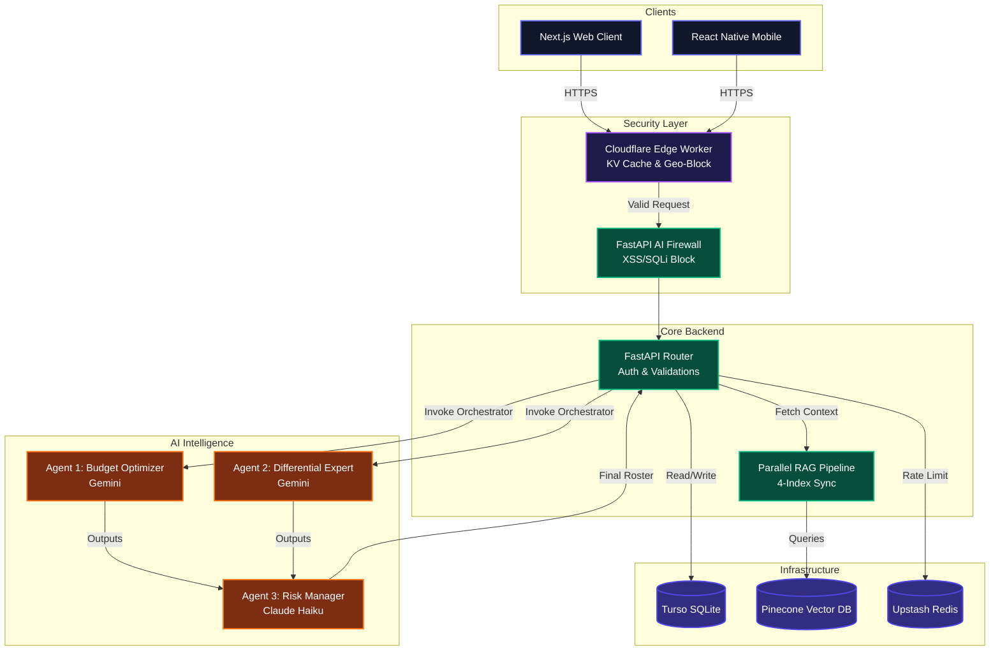

<div align="center">

  <a href="https://github.com/Inayat-0007/teamgenie-ai-PRIVATE-PATENT-2026">
    
  </a>
  <br>

  <h1>TeamGenie AI 🧞‍♂️</h1>
  <p><strong>A Hyper-Optimized, Multi-Agent Fantasy Sports Intelligence Framework.</strong></p>
  
  <p>
    <a href="https://teamgenie.app">View Demo</a> ·
    <a href="docs/technical/ARCHITECTURE.md">Read Architecture</a> ·
    <a href="CONTEXT.md">System Context</a>
  </p>

  <p>
    
    
    
  </p>
</div>

---

## 👋 Hey there! Let's talk about TeamGenie.

Welcome to the central repository for **TeamGenie AI**. I built this system to solve a very specific, computationally heavy problem: **How do we generate statistically optimal, risk-adjusted fantasy sports teams in under 5 seconds?**

Instead of relying on basic algorithms, this platform leverages a **Zero-Trust Multi-Agent AI System** (CrewAI with Gemini & Claude LLMs) to debate, analyze, and synthesize data in real-time. It's built for scale, resilience, and uncompromised performance. 

This repository isn't just a prototype; it's a completely scaffolded, edge-ready, tier-1 enterprise monorepo.

---

## 🗺️ Visual Architecture Mapping

Here is exactly how the system breathes. I designed the data flow to be highly isolated—the frontend has zero database context, and the AI agents have zero HTTP context. Pure, decoupled perfection.



---

## 🎬 Deep Dive: Inayat Developer Media

If you want to truly understand the mental models, architectural decisions, and visual interface flow that built this, I have created a deep-dive media folder specifically for you.

Inside the **`inayat DEVELOPER media`** directory at the root of this repository, you will find:
- 📀 **`TUTORIAL VIDEO.mp4` & `TUTORIAL VIDEO 2.mp4`**: Hands-on walkthroughs of the codebase and system operations.
- 📘 **`TeamGenie_AI_Playbook.pdf`**: The official playbook documentation detailing the system mechanics and vision.
- 🖼️ **`THUMBNIL.png`**: High-resolution project thumbnail.

👉 [**Click here to explore the Developer Media Folder**](https://github.com/Inayat-0007/teamgenie-ai-PRIVATE-PATENT-2026/tree/main/inayat%20DEVELOPER%20media)

---
## 🏗️ Repository Anatomy

I've structured this using **Turborepo**. It is the absolute best practice for massive TypeScript/Python hybrid projects, allowing us to share types and configurations instantly across applications.

*   📂 **`apps/`**
    *   `api/` — The FastAPI backend. Highly asynchronous, guarded by an AI firewall.
    *   `web/` — The Next.js 14 frontend. App Router, Framer Motion, Server Components.
    *   `mobile/` — The Expo 52 React Native app with NativeWind styling.
*   📂 **`packages/`**
    *   `ai/` — CrewAI agent configurations (strictly isolated mathematical engines).
    *   `rag/` — Vector embedding logic via Sentence-Transformers.
    *   `shared/` — TypeScript interfaces (Player, Team, User) shared by Web and Mobile.
*   📂 **`db/`** — Raw `.sql` migrations for LibSQL/Turso.
*   📂 **`infra/`** & **`monitoring/`** — Kubernetes HPA manifests and Prometheus/Sentry alerting rules.

---

## ⚡ Developer Quickstart

To get this running locally, I've completely simplified the startup sequence into a shell script.

1.  **Configure Environment:**
    Open `.env` (copy from `.env.example`) and paste your API keys (Gemini, Claude, Turso, Supabase).
2.  **Run Initialization:**
    ```bash
    ./scripts/setup.sh
    ```
    *(This script automatically installs Bun, builds Python environments, runs database migrations, and links the workspace).*
3.  **Launch Stack:**
    ```bash
    turbo dev
    ```

---

## 🤝 Code of Conduct & Master Context
If you are contributing, you **must** read `CONTEXT.md` in this repository before making a pull request. I enforce strict typing, comprehensive error handling through Sentry, and a zero-tolerance policy for committing secrets.

**Built with ❤️ for speed, scale, and intelligence.**
