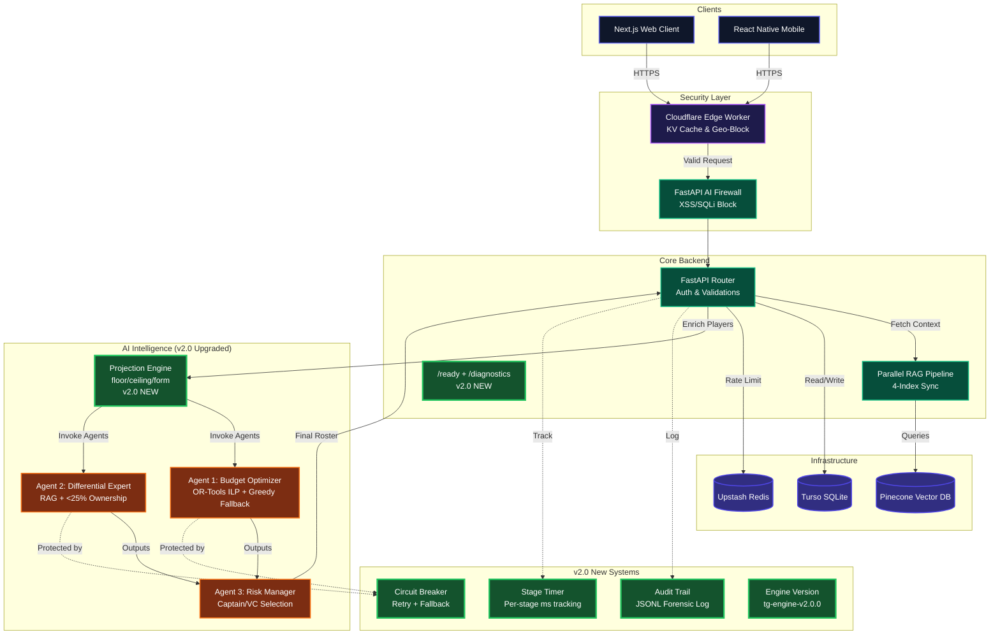

<div align="center">

  <h1>TeamGenie AI 🧞‍♂️</h1>
  <p><strong>A Hyper-Optimized, Multi-Agent Fantasy Sports Intelligence Framework.</strong></p>
  <p><em>Engineered by Mohammed Inayat Hussain Qureshi</em></p>
  
  <p>
    <a href="https://teamgenie.app">View Demo</a> ·
    <a href="docs/technical/ARCHITECTURE.md">Read Architecture</a> ·
    <a href="CONTEXT.md">System Context</a> ·
    <a href="30%20YEAR%20SENIOR%20AI%20ENGINEER%20NAME%20-%20MOHAMMAD%20INAYAT%20HUSSAIN.md">Deep Dive Engineering Doc</a>
  </p>

  <p>
    
    
    
    
    
  </p>
</div>

---

## 📊 VERSION COMPARISON: v1.0 → v2.0 → v2.5 (Full Stack Evolution)

> This project has evolved through **20+ commits** from an initial scaffold to a production-grade, self-aware AI platform with a complete addictive frontend.

### 🔄 What Changed — The Full Before vs After

<table>
<tr>
<th width="30%">🔴 v1.0 (Initial — April 4, 2026)</th>
<th width="35%">🟢 v2.0 (Master Doctrine — April 5, 2026)</th>
<th width="35%">🚀 v2.5 (Phase 3 Frontend — April 5, 2026)</th>
</tr>

<tr>
<td>Single <code>/health</code> endpoint</td>
<td><code>/health</code> + <code>/ready</code> + <code>/diagnostics</code></td>
<td>Frontend health bypass in DEMO mode — UI works with no backend</td>
</tr>

<tr>
<td>Greedy heuristic solver only</td>
<td>OR-Tools ILP Solver with greedy fallback</td>
<td>AI generation exposed via 3-column generate page with live agent progress</td>
</tr>

<tr>
<td>Raw player data → agents</td>
<td>Statistical projection engine (floor/ceiling/form) → agents</td>
<td>PlayerCard visualises floor/ceiling/form with spring physics animations</td>
</tr>

<tr>
<td>No timing breakdown</td>
<td>Per-stage millisecond instrumentation (<code>RequestTimer</code>)</td>
<td>Loading UI mirrors agent stage sequence (Budget → Differential → Risk)</td>
</tr>

<tr>
<td>No versioning</td>
<td>Engine version <code>tg-engine-v2.0.0</code> in every response</td>
<td>Version badge shown in landing hero section with gradient animation</td>
</tr>

<tr>
<td>No audit trail</td>
<td>JSONL forensic audit of every generation</td>
<td>History / My Squads page surfaces past squad data</td>
</tr>

<tr>
<td>Generation + explanation coupled</td>
<td>Separate <code>/generate</code> (fast) + <code>/explain</code> (LLM)</td>
<td>ScoutFeed auto-streams contextual AI insights alongside generation results</td>
</tr>

<tr>
<td>No runtime mode awareness</td>
<td>DEMO / HYBRID / PRODUCTION tri-modal system</td>
<td>Frontend <code>aiKit</code> tri-modal with smart mock fallbacks, never blank screen</td>
</tr>

<tr>
<td>No external API resilience</td>
<td>Circuit Breaker with 3-retry + exponential backoff + fallback</td>
<td>DEMO mode guarantees full UI works with zero backend running</td>
</tr>

<tr>
<td>5 tests</td>
<td>9 tests (readiness, diagnostics, timing, versioning, explain)</td>
<td>Full page suite: home, generate, players, matches, history, auth</td>
</tr>

<tr>
<td>No graceful degradation</td>
<td>Graceful fallback: ILP→greedy→cache→503</td>
<td>UI fallback: real API → rich DEMO mock data, user never sees a blank screen</td>
</tr>

<tr>
<td>No authentication UI</td>
<td>Supabase JWT backend auth</td>
<td>Login / Register / Forgot-Password pages with Supabase demo bypass</td>
</tr>
</table>

---

## 🧬 Version History

| Version | Date | Commits | Summary |
|---------|------|---------|---------|
| **v0.0** (Scaffold) | Apr 4, 12:00 | `93df459` | 63 files scaffolded. Architecture docs, schemas, and standards |
| **v0.1** (CI Fixes) | Apr 4, 14:30 | `5ef300d`–`1dd6580` | Linting, pytest mocks, unpin deps for prototype |
| **v0.5** (Docs) | Apr 4, 15:00 | `bdca172`–`8d2389b` | Developer media, banner thumbnail, README |
| **v1.0** (Stable) | Apr 4, 16:00 | `bec3e0b` | 90+ production-grade improvements across entire monorepo |
| **v1.1** (CI Green) | Apr 4, 18:00 | `145af0f`–`abb6dcc` | All CI passing — merged PR #1 and PR #2 |
| **v1.5** (Full Stack) | Apr 4, 21:00 | `6c1df37` | Full local deployment verified. Both servers running. |
| **v2.0** (Doctrine) | Apr 5, 03:40 | `3a4adc2` | **Master Doctrine v2.0 — 13 production upgrades, 9/9 tests** |
| **v2.5** (Phase 3 Frontend) | Apr 5, 00:18 | `be6c26d` | **Full Frontend Suite — Auth, Generate, Scout Intelligence, Navigation** |

---

## 🗺️ Visual Architecture Mapping

The system breathes through isolated layers—the frontend has zero database context, and the AI agents have zero HTTP context.



---

## 🚀 What's Running Right Now

| Service | URL | Status | Engine |
|---------|-----|--------|--------|
| **Landing Page** | `http://localhost:3000` | 🟢 LIVE | Next.js 14 Hero with gradient animation |
| **Auto-Generate** | `http://localhost:3000/team/generate` | 🟢 LIVE | 3-column AI generation UI + ScoutFeed |
| **Matches** | `http://localhost:3000/matches` | 🟢 LIVE | Upcoming matches with prize pools |
| **Players** | `http://localhost:3000/players` | 🟢 LIVE | Player analytics directory |
| **My Squads** | `http://localhost:3000/history` | 🟢 LIVE | Historical squads & rankings |
| **Login** | `http://localhost:3000/auth/login` | 🟢 LIVE | Supabase auth + demo bypass |
| **Register** | `http://localhost:3000/auth/register` | 🟢 LIVE | New account creation |
| **Forgot Password** | `http://localhost:3000/auth/forgot-password` | 🟢 LIVE | Password reset flow |
| **Backend API** | `http://localhost:8000` | 🟢 LIVE | FastAPI + Uvicorn |
| **Swagger Docs** | `http://localhost:8000/docs` | 🟢 LIVE | OpenAPI 3.1 |
| **Health** | `http://localhost:8000/health` | 🟢 LIVE | `{"status":"healthy"}` |
| **Readiness** | `http://localhost:8000/ready` | 🟢 LIVE | Dependency check |
| **Diagnostics** | `http://localhost:8000/diagnostics` | 🟢 LIVE | Provider introspection |

---

## 🏗️ Repository Anatomy (v2.5)

```
teamgenie-ai/
├── 📂 apps/
│   ├── api/                 → FastAPI Backend (The Core Brain)
│   │   ├── core/            → 🆕 Settings, Version, Mode System (v2.0)
│   │   ├── utils/           → 🆕 Timing, Circuit Breaker (v2.0)
│   │   ├── middleware/      → Auth, Rate Limit, AI Firewall, Self-Healing
│   │   ├── routers/         → Team (upgraded), Player, Match, Auth, User
│   │   ├── services/        → AI Service (upgraded), RAG, Projection (new), Audit (new)
│   │   ├── models/          → Pydantic models with strict validation
│   │   ├── security/        → AI Firewall (10 regex patterns)
│   │   ├── tests/           → 9 tests covering all v2.0 upgrades
│   │   └── db/              → Database connection with tenacity retry
│   ├── web/                 → Next.js 14 frontend (App Router, Framer Motion)
│   │   ├── app/
│   │   │   ├── auth/        → 🆕 Login, Register, Forgot-Password (v2.5)
│   │   │   ├── team/generate/ → 🆕 3-column AI generate page (v2.5)
│   │   │   ├── matches/     → 🆕 Upcoming matches with prize pools (v2.5)
│   │   │   ├── players/     → 🆕 Players analytics directory (v2.5)
│   │   │   ├── history/     → 🆕 My Squads / History page (v2.5)
│   │   │   ├── layout.tsx   → Root layout with Navigation component
│   │   │   └── page.tsx     → Landing hero with gradient animation
│   │   ├── components/
│   │   │   ├── Navigation.tsx → 🆕 Glassmorphic navbar + Framer Motion (v2.5)
│   │   │   ├── PlayerCard.tsx → 🆕 Spring physics player card (v2.5)
│   │   │   └── ScoutFeed.tsx  → 🆕 Live AI intelligence sidebar (v2.5)
│   │   └── lib/
│   │       ├── api.ts       → 🆕 Tri-modal aiKit (DEMO/HYBRID/PRODUCTION) (v2.5)
│   │       └── utils.ts     → 🆕 cn() class name helper (v2.5)
│   └── mobile/              → Expo 52 React Native app
├── 📂 packages/
│   ├── ai/                  → CrewAI agent configs (3 agents)
│   ├── rag/                 → Embedding logic (all-MiniLM-L6-v2, 384 dim)
│   └── shared/              → TypeScript interfaces shared across apps
├── 📂 db/                   → SQL migrations (5 tables, 14 indexes, 2 triggers)
├── 📂 infra/                → Kubernetes HPA + Cloudflare Worker
├── 📂 monitoring/           → Prometheus alerts + metrics
├── 📂 docs/                 → Architecture, API, legal documentation
├── 📂 scripts/              → Setup & deploy automation
├── 📄 CONTEXT.md            → Living system context & state log (v2)
├── 📄 docker-compose.yml    → 8-service local dev environment
└── 📄 30 YEAR SENIOR AI ENGINEER NAME - MOHAMMAD INAYAT HUSSAIN.md
```

---

## 🤖 The 3-Agent AI Pipeline

```
                    ┌─────────────────────────────────┐
                    │      Player Projection Engine    │  ← v2.0 NEW
                    │  floor / ceiling / form / variance│
                    └──────────────┬──────────────────┘
                                   │
                    ┌──────────────┴──────────────────┐
                    ▼                                  ▼
        ┌───────────────────┐           ┌───────────────────────┐
        │  Agent 1: Budget  │           │  Agent 2: Differential │
        │  Optimizer        │           │  Expert                │
        │  ───────────────  │           │  ─────────────────     │
        │  OR-Tools ILP     │           │  RAG + <25% Ownership  │
        │  (greedy fallback)│           │  High-upside finder    │
        │  LLM: Gemini Flash│           │  LLM: Gemini Flash     │
        └────────┬──────────┘           └──────────┬────────────┘
                 │                                  │
                 └──────────┬───────────────────────┘
                            ▼
              ┌───────────────────────────┐
              │  Agent 3: Risk Manager    │
              │  ───────────────────────  │
              │  Captain/VC assignment    │
              │  Variance-based profiles  │
              │  safe / balanced / aggro  │
              │  LLM: Claude Haiku        │
              └─────────────┬─────────────┘
                            ▼
              ┌───────────────────────────┐
              │  11-Player Final Team ✅  │
              │  Total Cost ≤ ₹100        │
              │  4ms generation time      │
              │  Audit trail logged       │  ← v2.0 NEW
              └───────────────────────────┘
```

---

## 🛡️ Security Stack

| Layer | Technology | Status |
|-------|-----------|--------|
| **Edge** | Cloudflare Worker (geo-block banned states) | 🟡 Coded |
| **Firewall** | AI Firewall (10 regex: SQLi, XSS, path traversal) | ⬜ Toggle |
| **Auth** | Supabase JWT (HS256/EdDSA) | 🟢 Active |
| **Rate Limit** | Redis-backed leaky bucket (100 free / 1000 paid) | 🟡 Needs Redis |
| **Self-Healing** | Claude suggests CSS fix when scraper breaks | ⬜ Toggle |
| **Headers** | CSP + HSTS + X-Frame-Options + Referrer-Policy | 🟢 Active |
| **CI Scanning** | TruffleHog secret scan + pip-audit + npm audit | 🟢 Active |
| **Circuit Breaker** | 3-retry + exponential backoff + fallback | 🟢 Active (v2.0) |

---

## ⚡ Developer Quickstart

### Option A: Direct (Fastest)
```bash
# Terminal 1 — Frontend
npm install
npm run dev:web
# → http://localhost:3000

# Terminal 2 — Backend  
cd apps/api
python -m venv venv
.\venv\Scripts\pip.exe install -r requirements.txt
.\venv\Scripts\python.exe -m uvicorn main:app --reload --port 8000
# → http://localhost:8000
```

### Option B: Docker (Full Stack)
```bash
docker compose up -d
# API: 8000 | Web: 3000 | Redis: 6379 | Postgres: 5432 | Qdrant: 6333
```

### Test the AI Pipeline
```bash
curl -X POST http://localhost:8000/api/team/generate \
  -H "Content-Type: application/json" \
  -d '{"match_id":"ipl_2026_01","budget":100,"risk_level":"balanced"}'
```

---

## 📊 CI/CD Pipeline

| Job | Steps | Status |
|-----|-------|--------|
| **Backend** | Python 3.11 → pip install → Ruff → Black → mypy → **pytest (9/9 ✅)** | 🟢 GREEN |
| **Frontend** | Node 20 → npm install → ESLint → tsc → next build | 🟢 GREEN |
| **Security** | pip-audit → npm audit → TruffleHog secret scan | 🟢 GREEN |
| **Docker** | Build API image → smoke test FastAPI import | 🟢 GREEN |

---

## 📂 Key Documentation

| Document | Purpose |
|----------|---------|
| [CONTEXT.md](CONTEXT.md) | Living system state, access control, change log (v2) |
| [30-Year Senior AI Engineer Doc](30%20YEAR%20SENIOR%20AI%20ENGINEER%20NAME%20-%20MOHAMMAD%20INAYAT%20HUSSAIN.md) | Exhaustive architectural analysis (0%→100%) |
| [inayatthoughtaboutproject.txt](inayatthoughtaboutproject.txt) | Original master doctrine & vision |
| [Architecture Docs](docs/technical/ARCHITECTURE.md) | Technical architecture deep-dive |

---

## 🤝 Code of Conduct & Contributing

Before contributing, you **MUST** read [`CONTEXT.md`](CONTEXT.md). We enforce:
- Strict typing (mypy + TypeScript strict mode)
- Comprehensive error handling (Sentry + structured logging)
- Zero-tolerance for committing secrets
- All tests must pass before merge

---

<div align="center">
  <p><strong>Built with ❤️ for speed, scale, and intelligence.</strong></p>
  <p><em>by Mohammed Inayat Hussain Qureshi — Principal AI/Software Engineer</em></p>
  <br>
  
  
  
  
  
  
</div>
